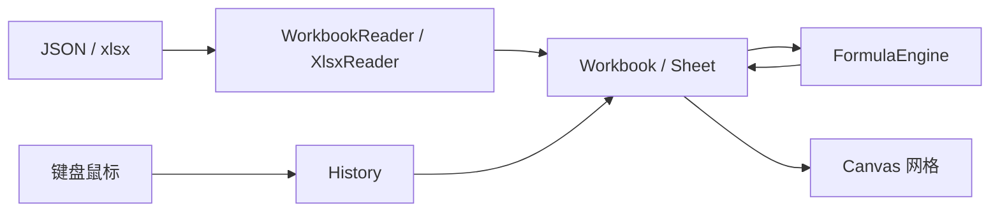

# humpk-office Spreadsheet

浏览器里的表格查看与编辑器，面向 `.xlsx` 与自有 JSON。打开本地文件后按网格绘制，再在画布上编辑单元格、公式和样式。

本仓库是作者此前用 JavaScript 写的表格引擎（xlsheet / x-spreadsheet）的重写：在 Cursor 里把原 JS 实现转为 TypeScript，并按一类一文件继续拆模块。模型（稀疏行列、样式索引、Canvas 即时绘制）沿用旧思路，代码是新写的 TS，不是机械翻译。

姐妹仓库：[humpk-office-word](https://github.com/zhangjintao-china-123/humpk-office-word)。不是完整的 Microsoft Excel 替代品。

## 功能

- **网格**：Canvas 只画可视区域；行列头、选区、合并单元格、自定义滚动条
- **编辑**：单击选格、拖选、双击或直接键入；公式栏；中文输入法；撤销 / 重做；格式刷
- **公式**：`SUM` `AVERAGE` `MAX` `MIN` `IF` `AND` `OR` `CONCAT`，支持 `A1`、`A1:B5`、四则运算
- **样式**：字体、字号、加粗 / 倾斜 / 下划线 / 删除线、颜色、填充、对齐、边框、换行
- **结构**：插删行列、拖拽改行高列宽、合并 / 拆分
- **筛选与冻结**：自动筛选（排序、勾选值）；冻结窗格
- **打印**：打印预览，按使用区域分页
- **多表**：底栏新增、切换、双击改名
- **文件**：打开 / 保存 JSON；导入 / 导出 `.xlsx`（ExcelJS，映射单元格、公式、样式、合并、行列尺寸、浮动图片）
- **浮动图片**：工具栏 / 右键插入，拖动与缩放，Delete 删除；JSON 字段 `uploadimages` 与原 xlsheet 兼容

## 原理

表格不是 DOM 格子，而是一张 Canvas。模型里存稀疏行列和样式索引，绘制层按滚动算出可见范围再画。点选对着坐标做命中。编辑时一层 textarea 盖在格子上接 IME，改的是模型，再重算公式、整帧重画。



## 环境

- Node.js 20 或更高
- npm

## 安装与运行

```bash
git clone https://github.com/zhangjintao-china-123/humpk-office-spreadsheet.git
cd humpk-office-spreadsheet
npm install
npm run dev
```

终端会打印本地地址，一般是 `http://127.0.0.1:5173/`。若 5173 已被占用，Vite 会改用下一个端口（例如 `5174`）。用浏览器打开该地址即可。

### 其他命令

```bash
npm test          # 跑一遍单元测试
npm run test:watch
npm run build     # 类型检查并打包
```

## 怎么用

1. 点 Ribbon **打开 JSON** 或 **导入 Excel**，选择本机文件；或直接在空白表里输入。
2. 双击或直接键入编辑单元格；公式栏改公式；Ribbon 改字体、对齐、边框。
3. 需要时用自动筛选、冻结窗格、插入浮动图片、打印预览。
4. 点 **保存 JSON** 或 **导出 Excel** 下载当前工作簿。

常用快捷键：

| 操作 | Windows / Linux | macOS |
| --- | --- | --- |
| 撤销 / 重做 | `Ctrl+Z` / `Y` 或 `Ctrl+Shift+Z` | `Cmd+Z` / `Shift+Z` |
| 剪切 / 复制 / 粘贴 | `Ctrl+X` / `C` / `V` | `Cmd+X` / `C` / `V` |
| 保存 | `Ctrl+S` | `Cmd+S` |
| 打印预览 | `Ctrl+P` | `Cmd+P` |
| 加粗 / 倾斜 / 下划线 | `Ctrl+B` / `I` / `U` | `Cmd+B` / `I` / `U` |
| 全选 | `Ctrl+A` | `Cmd+A` |
| 整行 / 整列 | `Shift+Space` / `Ctrl+Space` | `Shift+Space` / `Cmd+Space` |
| 跳到数据边缘 | `Ctrl+方向键` | `Cmd+方向键` |
| 扩展选区 | `Shift` / `Ctrl+Shift+方向键` | `Shift` / `Cmd+Shift+方向键` |
| 行首 / 行尾 | `Home` / `End` | `Home` / `End` |
| 表头 / 末格 | `Ctrl+Home` / `End` | `Cmd+Home` / `End` |
| 翻页 | `PageUp` / `PageDown` | `PageUp` / `PageDown` |
| 编辑单元格 | `F2` 或直接键入 | `F2` 或直接键入 |
| 编辑中换行 | `Alt+Enter` | `Option+Enter` |
| 编辑中确认并移动 | `Enter` / `Tab` / 方向键 | `Enter` / `Tab` / 方向键 |
| 选中图片微调 | 方向键（Shift 步进 10） | 方向键（Shift 步进 10） |

## 当前限制

- 没有协作、数据校验、图表、数据透视
- 公式函数集有限，未覆盖 Excel 全部函数
- 系统剪贴板走纯文本；带样式的复制粘贴主要走内部剪贴板

## 许可

[MIT](LICENSE)
